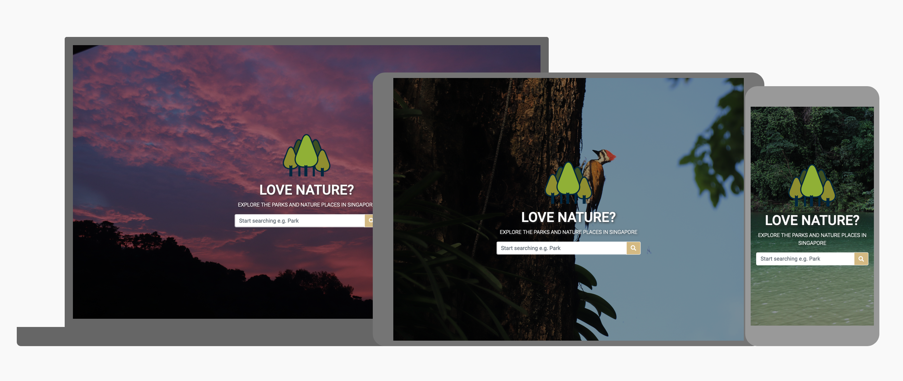
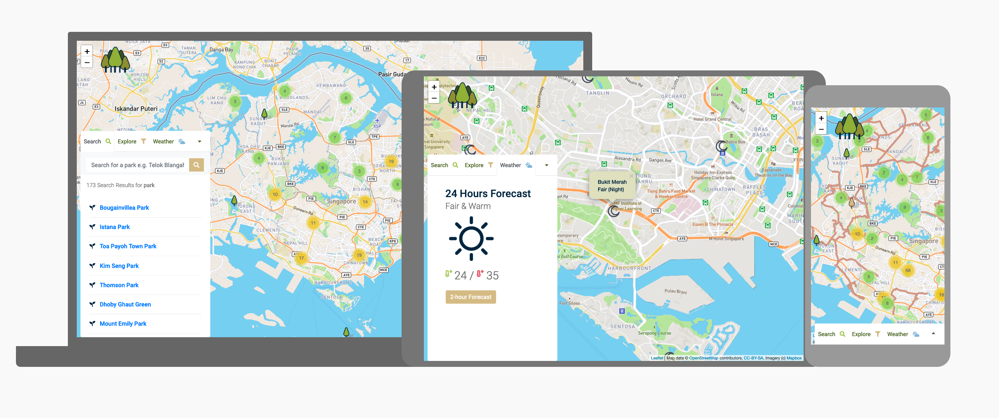

## Singapore Nature Finder

As a nature lover, living in a fast pace city like Singapore can be exhausted at times. Hiking or walking in the nature has become a necessity to make myself healthier mentally and physically. This had therefore became the concept behind this nature finder app, where user can find a nature place in Singapore, at the same time checking out the weather for them to plan for the trip out.

The demo of the live website can be accessed here:

https://jolenewai.github.io/singapore-nature-finder/ 


# UX/UI 

The aim of the UX/UI is to create a lightweight app to search for a nature places and able to plan for their hiking/excursion

## Information Structure / Flow

This is a one page app website. The page is divided into 2 sections, the landing page and the map.

On the landing page, the app will first address to the users with greetings and a search bar to encourage user to type something to search. The map section will be triggered when the user press down the "Enter" key or click on the search button.

On the map section, information/functions are organised into 3 tabs:
* Search 
* Explore 
* Weather 



### Search
* Search results of parks will be displayed here
* Details of the parks including images will be displayed whenever available
* User can interact with the map through clicking on the result link, the map will zoom in to show the targeted marker

### Explore
* Allow user to interact with the map to explore more on the nature places/paths 
* User can switch between position marker or park area on the map
* User can add or remove optional layers of Heritage Trees, Cycling Path, Park Connectors and National Park Tracks
* User can remove all the layers and reset the map by clicking on the "Reset" button

### Weather
* 24-hour weather forecast will be displayed here
* 2-hr weather forecast can be triggered through clicking the button and will be displayed on the map

### Map
* All icons used on the map are customised and legends are included on the explore tab 
* By clicking the markers, areas, lines on the map, user will be able to see relevant information to the feature

## Target Audience
* Nature lovers like me in Singapore
* People who likes to do sports/exercises in nature in Singapore
* People who is planning for hiking/activities at nature places in Singapore

## Responsiveness

This website is responsive to mobile and other smaller devices

## Colours

Vibrant colours associated with nature are selected in this design.


This set of colours are inspired by the colours found in the forest and nature reserves.

## Layout

__Typography__

* Sans serif font is selected for a clean and cutting edge look and feel

__Collapsible Tab__

* Collapsible tab is used to make sure the map can be viewed unobstructed across devices of all sizes

## Technology

* HTML 
* CSS
* Javascript 
* JQuery
* Adobe XD

### Callback functions
* Data are loaded on request basis, therefore callback functions are used in this app most of the time

```javacript

function getData(apiURL, callback){
        getApi(apiURL, callback)
    }

function getApi(apiURL, callback){

    axios.get(apiURL).then(function(response){
        callback(response.data) 
    })

}

```


## Plugins
* [LeafletJS](https://leafletjs.com/)
* [axios](https://github.com/axios/axios)
* [csvtoJson](https://github.com/Keyang/node-csvtojson)
* [Bootstrap version 4.4](https://getbootstrap.com/)


## Reference / Credits
* Most of the data and API are from [data.gov.sg](https://data.gov.sg/)
* Photos from [flyin.fish.82](https://www.instagram.com/flyin.fish.82/)
* Park Details are extracted from [National Parks Board](https://www.nparks.gov.sg/)
* Screenshots created using [Google Material.io Resizer](https://material.io/resources/resizer/)


--------